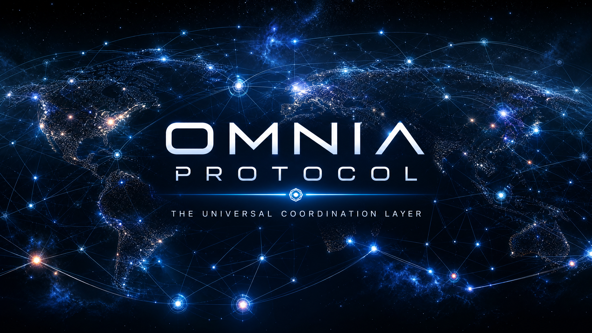

<p align="center">
  
</p>

<p align="center">
  <a href="https://github.com/Willow7737/omnia-protocol/actions/workflows/ci.yml">
    
  </a>
  
  
  
  
  
  
  
  
</p>

<h1 align="center">Omnia Protocol</h1>

<p align="center">
  <strong>The Universal Coordination Layer for Reality</strong><br>
  <em>A settlement-agnostic protocol that replaces trust with mathematics, using causal graph consensus for parallel transaction processing.</em>
</p>

[](https://discord.gg/qYkpAeSYR)

---

## 🚪 Choose Your Path

| If you are... | Start Here | Next Step |
|---------------|------------|-----------|
| 🌱 New to Omnia | [docs/use-cases/](docs/use-cases/) | [Quick Start](#-quick-start) |
| 💻 Contributor | [CONTRIBUTING.md](CONTRIBUTING.md) | [docs/architecture/](docs/architecture/) |
| 🏗️ Systems Architect | [docs/reference/blueprint-reference.md](docs/reference/blueprint-reference.md) | [docs/architecture/trait-boundaries.md](docs/architecture/trait-boundaries.md) |
| 📦 Validator Operator | [docs/building/feature-matrix.md](docs/building/feature-matrix.md) | [docs/operations/validator-setup.md](docs/operations/validator-setup.md) |
| 📊 Performance Engineer | [docs/reference/benchmark-gates.md](docs/reference/benchmark-gates.md) | [docs/architecture/pipeline-design.md](docs/architecture/pipeline-design.md) |

---

## 🏗️ The Omnia Architecture

```
┌──────────────────────────────────────────────────┐
│  LAYER 5: Economics (UBC, Governance)           │ ✅ IMPLEMENTED
├──────────────────────────────────────────────────┤
│  LAYER 4: Identity (DIDs, Shamir, Bio)          │ ✅ IMPLEMENTED
├──────────────────────────────────────────────────┤
│  LAYER 3: Binding (Provenance, RF, QC)          │ ✅ IMPLEMENTED
├──────────────────────────────────────────────────┤
│  LAYER 2: Domain Shards (6 shards)              │ ✅ IMPLEMENTED
├──────────────────────────────────────────────────┤
│  LAYER 1: Substrate (Causal Graph)              │ ✅ IMPLEMENTED
├──────────────────────────────────────────────────┤
│  PHASE 0: ZK-Rollup (Settlement Layer)          │ ✅ IMPLEMENTED
├──────────────────────────────────────────────────┤
│  THROUGHPUT OPT: Sharded State + Batch + Pool   │ ✅ SPRINTS 0-5
│  + Compact Encoding + Bloom + Priority Gossip   │
├──────────────────────────────────────────────────┤
│  PHASE 0 REMEDIATION: Critical Security Fixes   │ ✅ COMPLETE
│  + Feldman VSS DKG + SRS Binding + Auth Fixes   │
├──────────────────────────────────────────────────┤
│  NODE INTEGRATION: Background Consensus Loop    │ ✅ COMPLETE
│  + Pipeline Router Workers + P2P Network Task   │
├──────────────────────────────────────────────────┤
│  MERKLE TYPE SAFETY: Generic MerkleProof<H>     │ ✅ COMPLETE
│  + Blake3/Poseidon markers prevent mismatch     │
├──────────────────────────────────────────────────┤
│  CEREMONY API: Wired to CeremonyServer          │ ✅ COMPLETE
├──────────────────────────────────────────────────┤
│  PLACEHOLDER FIXES: Reject invalid proofs        │ ✅ COMPLETE
├──────────────────────────────────────────────────┘
```

---

## 🔬 What Is Omnia?

Omnia is not a company, a coin, or an app. It is a **protocol** — a fundamental set of rules that any computer can follow to participate in a shared, unchangeable record of truth. It uses **causal graph consensus** (DAG + vector clocks + CRDTs) instead of sequential blockchains to achieve parallel transaction processing. The protocol is **settlement-agnostic** — it can settle on Ethereum, Bitcoin, Solana, or any L1 with data availability and proof verification.

### The Problem We Solve

| Challenge | Impact | Omnia's Solution |
| :--- | :--- | :--- |
| **Inefficient Blockchains** | High fees and energy waste | Parallel causal graph consensus |
| **Broken Governance** | Opaque decisions and ignored votes | Quadratic voting + reputation decay |
| **Data Exploitation** | Corporate profit from personal info | User-controlled data via Zero-Knowledge Proofs |
| **Opaque Supply Chains** | Hidden child labor and fake medicine | Cryptographic birth certificates for physical items |
| **Centralized AI** | Corporate control of models and data | Distributed training with shared rewards |
| **Speculative Crypto** | Wealth concentration and volatility | Universal Basic Compute for all participants |

---

## 🧪 Workspace

| Crate | Purpose | Tests | Status |
|-------|---------|-------|--------|
| `omnia-primitives/` | Shared types: Event, VectorClock, wire format | 68 | ✅ |
| `omnia-crypto/` | Ed25519, BLS, VRF, AES-GCM, keystore, PQC, DKG | 189 | ✅ |
| `omnia-consensus/` | Causal graph, consensus engine, mempool, CRDTs, slashing | 294 | ✅ |
| `omnia-network/` | P2P networking: gossipsub, fast-sync, snapshots | 126 | ✅ |
| `omnia-adapters/` | ZK-rollup (arkworks R1CS + Groth16), settlement adapters | 149 | ✅ |
| `substrate/` | Causal graph, consensus, gossip, crypto, CRDTs, slashing (redb) | 72 | ✅ |
| `shards/` | 6 domain shards + cross-shard messaging | 120 | ✅ |
| `binding/` | Provenance log, RF stub, hybrid PQC signatures | 86 | ✅ |
| `economics/` | UBC token, quota, governance, useful work | 88 | ✅ |
| `node/` | Binary entrypoint, REST API, health/metrics, consensus loop | 67 | ✅ |
| `chaos-tests/` | Network partitions, crash recovery, byzantine, message loss | 84 | ✅ |
| `fuzz/` | 12 fuzz harnesses (libfuzzer) | 12 targets | ✅ |
| `benches/` | Throughput, ZK, IAI/Callgrind hot-path benchmarks | 5 suites | ✅ |
| `tests/` | Integration tests | 39 | ✅ |

**Total: 224 Rust source files, 81,000+ lines, 1,382 tests — all passing.**

---

## 🚀 Quick Start

```bash
git clone https://github.com/Willow7737/omnia-protocol.git
cd omnia-protocol
cargo test --workspace
cargo bench --no-run
```

---

## ✅ What's Implemented

### Layer 1: Substrate ✅
- Causal graph (DAG) with vector clock ordering
- Hashgraph-like two-parent events
- AlephBFT-inspired BFT finality
- CRDT state convergence (GCounter, OrSet, LWWRegister)
- libp2p gossip protocol (QUIC + GossipSub + mDNS)
- Ed25519 signatures with replay protection
- Performance: O(new_events) consensus processing (not O(n) graph walk)
- SlashingEngine with equivocation/liveness/invalid attestation detection
- Persistent slashing state via `redb` embedded database (`RedbSlashingStore`)
- Security: `state_root()`, `merkle_proof()`, `prune_old_events()`

### Layer 2: Domain Shards ✅
- 6 shards: Financial, Identity, Physical, Computational, Biological, Economics
- Shard router with automatic dispatch (`EventProcessor` trait)
- Cross-shard messaging with causality proofs
- Fee enforcement via FeeSchedule + QuotaSystem integration
- Security: Per-creator nonce replay protection (`last_nonces` in ShardRouter)
- FinancialShard uses strict causal ordering (not CRDTs) for balance consistency

### Layer 3: Binding Layer ✅
- Append-only provenance log (CRDT) with BLAKE3 hash-chain integrity
- Physical anchor (RF + quantum + provenance)
- ProvenanceTracker with create/transfer/verify/destroy lifecycle
- Hybrid PQC signatures (Ed25519 + CRYSTALS-Dilithium)
- PqcKeyRotationManager for post-quantum key rotation (3-phase migration)
- ⚠️ **STUB**: RF fingerprinting (needs SDR hardware; see [stub inventory](docs/stub-inventory.md))

### Layer 4: Identity Hardening ✅
- `did:omnia:` method with validation
- Shamir's Secret Sharing over GF(256)
- Privacy-preserving biometric anchors (BLAKE3(salt || template))
- AI agent identity with 5 capability types
- Social recovery with guardian threshold

### Layer 5: Economics ✅
- Universal Basic Compute (UBC) — soulbound monthly quota
- Quota system with epoch advancement
- Quadratic voting with exponential reputation decay
- Fixed-point governance decay (PPM arithmetic, no f64 in consensus)
- ⚠️ **STUB**: Proof-of-useful-work (3 work types defined, not production; see [stub inventory](docs/stub-inventory.md))

### Phase 0: ZK-Rollup ✅
- Settlement-agnostic architecture (`SettlementAdapter` + `SettlementLayer` traits)
- Ethereum adapter with Solidity contract (OmniaRollup.sol) — live mode via `ethereum-live` feature
- FFI settlement adapter for production C-library integration (`settlement-ffi` feature)
- Celestia adapter with RPC integration (`celestia` feature)
- ⚠️ **STUB**: Bitcoin, Solana, Cosmos settlement adapters (see [stub inventory](docs/stub-inventory.md))
- L2 operator with batch builder (TOCTOU race condition fixed)
- ZK circuit (arkworks R1CS + Groth16 on BN254)
- Expanded circuit with Merkle path verification + per-event state transition constraints
- SRS-to-key derivation with cryptographic binding (`derive_keys_deterministic_from_srs`)
- Sparse Merkle tree proofs (BLAKE3 off-circuit)
- Event pruning for sustainability
- ⚠️ Placeholder: ExpandedRollupCircuit uses Poseidon hash (production-ready, but parameters use Cauchy MDS + BLAKE3 round constants, not Grain LFSR from paper)

### Phase 0 Remediation ✅
- **Coin round** integrated into fame determination (breaks split-vote deadlocks)
- **Feldman VSS DKG** replaces deprecated key aggregation (`FeldmanVssSession`)
- **SRS binding** in key derivation (`derive_keys_deterministic_from_srs`)
- **Multi-node integration test** with in-memory consensus simulation
- **Financial shard** burn authorization (creator must match `from`)
- **Physical shard** transfer authorization (caller must be current owner)
- **Bounded sequence tracking** (`max_sequence_entries` in `ConsensusConfig`)
- **RollupOperator** race condition fix (single atomic read lock)
- **BLS duplicate signer detection** (`aggregate_signatures_dedup`)
- **SLIP-0010 key derivation** (HMAC-SHA512, BIP-44 path for Ed25519)
- **Domain shard verification** (`real_verification` feature gate)
- **Chaos suite** fixes (byzantine equivocation actually generates conflicts)

---

## 🌑 What's Not Yet Implemented

| Feature | Status | Notes |
|---------|--------|-------|
| Real RF fingerprinting | ⚠️ **STUB** | Needs HackRF/USRP hardware |
| Bitcoin settlement adapter | ⚠️ **STUB** | Implements trait, returns hardcoded values |
| Solana settlement adapter | ⚠️ **STUB** | Implements trait, no-op methods |
| Cosmos settlement adapter | ⚠️ **STUB** | Implements trait, no-op methods |
| Proof-of-useful-work | ⚠️ **STUB** | 3 types defined, no real verification |
| Mobile wallet | 🌑 Not started | Planned for post-testnet |
| Validator network | 🌑 Not started | Single-node operator currently |
| Conviction voting | 🌑 Not started | Planned for post-testnet |
| Delegation | 🌑 Not started | Planned for post-testnet |
| Production ZK hash gadget | ✅ Poseidon implemented | Cauchy MDS + BLAKE3 round constants (not Grain LFSR) |

> **Full stub inventory**: See [docs/stub-inventory.md](docs/stub-inventory.md) for detailed documentation of all stubs and partial implementations.

---

## 📊 Transparency Dashboard

To uphold our commitment to radical transparency, we maintain a live dashboard of our progress, requirements, and team health.

- [**Project Dashboard**](docs/reference/project-dashboard.md) - High-level overview, team status, and risk assessment.
- [**Requirements & Status**](docs/reference/status.md) - Granular tracking of technical requirements and completion.

---

## 🗺️ Implementation Roadmap

### Phase 0: The Seed ✅ Complete
*Goal: Proof of Concept*
- ✅ Causal graph consensus (Rust, 68 primitives tests + 294 consensus tests)
- ✅ Self-sovereign identity system (DIDs, Shamir, biometrics)
- ✅ Universal Basic Compute (UBC)
- ✅ 6 domain shards with cross-shard messaging
- ✅ Settlement-agnostic ZK-rollup architecture
- ✅ Full ZK circuit (arkworks R1CS + Groth16 + Poseidon)
- ✅ Real PQC signatures (ML-KEM-768 / FIPS-203)
- ✅ REST API with JWT auth, rate limiting, CORS
- ✅ Encrypted keystore (AES-256-GCM)
- ✅ Gradual slashing (3-tier: Warning → Jail → Ejection)
- ✅ BFT consensus with VRF leader selection
- ✅ Docker 5-node testnet + monitoring stack

### Phase 1: Hardening ✅ Complete
*Goal: Code Quality*
- ✅ Typed error migration — 34 `thiserror` enums
- ✅ `unwrap()` replacement — `#![deny(clippy::unwrap_used)]` on all crates
- ✅ E2E REST API Integration Tests — 19 test functions
- ✅ Code coverage integration — `cargo llvm-cov` in CI
- ✅ RUSTSEC advisory review — stale ignores removed
- ✅ Documentation sprint — 50+ discrepancy fixes
- ✅ Solidity Groth16 Verifier — production-quality with BN254 precompiles
- ✅ Rustdoc coverage — 35 documentation items

### Phase 2: Cryptographic Key Management & ZK Hardening ✅ Complete
*Goal: Security Closure*
- ✅ SSS recovery flow with encrypted shares and key derivation
- ✅ Trusted setup ceremony with real EC scalar multiplication
- ✅ ZK circuit dummy fields populated with event semantics constraints
- ✅ ZK-SNARK benchmark suite
- ✅ Groth16 batch verification
- ✅ PQC key rotation with encrypted keystore
- ✅ Gradual slashing with jail/suspension and events
- ✅ BIP-39 mnemonic support
- ✅ DKG for threshold signatures (Feldman VSS)
- ✅ Complete sled removal (migrated to redb)
- ✅ ADRs 010–014

### Phase 3: Network Optimization & Security Closure ✅ Complete
*Goal: Production Network Readiness*
- ✅ SSS/DKG share encryption — XOR to AES-256-GCM
- ✅ ZK circuit trusted setup dummy values + transcript hash initialization
- ✅ Leader selection wired into consensus block production
- ✅ Kademlia DHT + NAT Traversal
- ✅ GossipSub peer scoring configuration
- ✅ Consensus state persistence across restarts
- ✅ Real Ethereum settlement adapter (Alloy, `ethereum-live` feature flag)
- ✅ ML-KEM-768 key encapsulation (FIPS-203, KyberSlash eliminated)
- ✅ Fast-sync protocol with BLAKE3 checkpoints
- ✅ Message compression (Snappy for >256 bytes)
- ✅ Load testing infrastructure
- ✅ RUSTSEC advisory cleanup

### Phase 4: Mainnet Readiness ✅ Complete
*Goal: Production Hardening*
- ✅ Real Ethereum settlement with Alloy
- ✅ Gradual slashing implementation — ADR-011
- ✅ Migrate pqc_kyber → ml-kem (fix KyberSlash, FIPS-203)
- ✅ Fast-sync P2P automation
- ✅ Separate liveness and readiness probes
- ✅ Multi-party trusted setup ceremony automation
- ✅ Documentation sprint — ADRs 015–021
- ✅ Load testing baseline capture
- ✅ Supply chain hardening (cargo-vet, cargo-deny, SBOM)

### Phase 5: Testnet Launch & Validation ✅ Validated
*Goal: Performance Validation*
- ✅ Real performance benchmarking (~7,190 events/sec synchronous single-node; ~13.6× improvement over initial tokio-based measurements)
- ✅ Multi-node BFT testnet validation (3-node E2E via real libp2p)
- ✅ VRF migration to ECVRF per RFC 9381
- ✅ Genesis tooling — network bootstrap procedure
- ✅ Ethereum testnet integration test
- ✅ Poseidon dual-hash transition foundation
- ✅ Bug bounty program ($100–$50,000, 90-day embargo)
- ✅ External audit preparation package
- ✅ Side-channel audit for ZK and binding crates

### Phase 0 Throughput Optimization (Sprints 0–5) ✅ Complete
- ✅ Sprint 0: Baseline benchmarks, 3-node testnet Docker Compose, monitoring stack
- ✅ Sprint 1: `ShardedConsensusState` — 256-shard RwLock for parallel event processing
- ✅ Sprint 2: `BatchIngestor` + `ConsensusEventBatch` — amortized validation & proof generation
- ✅ Sprint 3: `EventPool` + `PruningAwarePool` — pre-allocated arena allocator with slot reuse
- ✅ Sprint 4: `CompactEncoder` + `GossipBloomFilter` + `PriorityGossipQueue` — optimized gossip
- ✅ Sprint 5: Integration test suite, 168h stability framework, full chaos suite, completion report
- ✅ Phase 0 Completion Report: [`docs/reports/phase0-completion-report.md`](docs/reports/phase0-completion-report.md)

**Optimization Results**: ~40% wire size reduction, O(1) duplicate detection, priority-based finality propagation, pre-allocated graph insertion with slot reuse.

### Post-Phase 5: Audit & Hardening 🔄 In Progress
- ✅ 7 high-priority audit findings remediated (BatchCrdtMerger rollback, GCounter overflow, constant-time VRF/BLS, DkgSession fixes, gossip topic mismatch, KeyStoreBridge persistence)
- ✅ 1 medium-priority finding remediated (signature dedup)
- ✅ Event submission now uses node's persistent keypair (not ephemeral)
- 🔄 14 medium-priority findings tracked (see [status.md](docs/reference/status.md))
- 📋 External security audit
- 📋 Public testnet launch

### Future Phases

| Phase | Goal | Status |
|-------|------|--------|
| Phase 6: Public Testnet | Multi-node testnet, external audit | 📋 Planned |
| Phase 7: Mainnet | Sybil resistance, GC, formal verification | 📋 Planned |
| Phase 8: Decentralization | Hardware mesh, production PoUW | 📋 Long-term |
| Phase 9: Universality | Relativistic consensus, physical-digital fusion | 📋 Long-term |

---

## 📈 Honest Performance Numbers

| Metric | Measured | Conditions |
|--------|----------|------------|
| **Synchronous pipeline** | ~7,190 evt/s (v0.1.48 micro-benchmark) | Release build, single-node, no async |
| **Async (tokio)** | Obsoleted by sync benchmark | Previous tokio-based measurement was an artifact of async runtime overhead, not a consensus limit |
| **Finality latency p50** | 93 µs (Criterion benchmark) | Synchronous, single-node |
| **Graph insert p50** | 18 µs (Criterion benchmark, insertion only) | O(1) amortized, 0→1000 events |
| **Ed25519 verify** | ~27,000 sig/s (est., test timing) | Standalone |
| **Groth16 prove (expanded)** | ~88 ms/event (Criterion benchmark) | BN254, R1CS |
| **Groth16 verify** | ~2.7 ms (Criterion benchmark) | Single proof |
| **VRF compute** | ~19 µs (Criterion benchmark) | Ed25519 + BLAKE3 |
| **CRDT batch merge** | ~100K ops/s (est., no dedicated benchmark) | 1K ops/batch |

> Numbers marked (est.) are approximate and environment-dependent, not from rigorous Criterion benchmarks. Numbers marked (Criterion benchmark) or (v0.1.48 micro-benchmark) come from reproducible benchmark suites. Real-world throughput will be lower due to network latency, BFT supermajority requirements, and ZK proof generation overhead. For reproduction, run: `cargo bench --bench baseline_bench`, `cargo bench --bench throughput`, `cargo bench --bench zk_benchmarks --features full`

### ZK Throughput Bottleneck

The consensus pipeline can process ~7,190 events/sec, but Groth16 proof generation for the expanded circuit runs at ~88 ms/event (~11.4 events/sec). This creates a **~560× throughput gap** between consensus and ZK settlement. In practice, ZK rollups will batch events and generate proofs asynchronously — the pipeline design decouples consensus from proof generation so that slow proving does not block transaction finality. This is the expected trade-off for Groth16 on BN254 and will be addressed with hardware acceleration, proof aggregation, or alternative SNARK constructions in future phases.

---

## 📚 Documentation

Full documentation is organized in [docs/](docs/):

- [**docs/architecture/**](docs/architecture/) — Layer specifications, trait boundaries, pipeline design, CRDT proofs, consensus queue
- [**docs/building/**](docs/building/) — Feature flags, cross-compilation, binary optimization
- [**docs/operations/**](docs/operations/) — Validator setup, monitoring, deployment, runbook, CLI & API
- [**docs/reference/**](docs/reference/) — Roadmap, benchmarks, ADR index, security audit, dependency policy, economic analysis, phase reports
- [**docs/use-cases/**](docs/use-cases/) — Real-world scenarios, FAQ, governance

Quick links:
- [**Architecture**](docs/architecture/) — Links to canonical architecture docs
- [**Implementation Spec**](docs/reference/implementation-spec.md) — Protocol specifications
- [**Research**](./substrate/RESEARCH.md) — Consensus research and implementation results

---

## 🤝 Contributing

Omnia thrives through open collaboration. This is a **Rust-only codebase**. See [**CONTRIBUTING.md**](./CONTRIBUTING.md) for guidelines.

```bash
cargo test --workspace    # Run all tests
cargo clippy -- -D warnings  # Lint
cargo fmt --check         # Check formatting
```

---

## 💬 Community & Support

Omnia is a public-interest protocol. Join the conversation:

- **[GitHub Discussions](discussions)** - Questions, ideas, and general community interaction.
- **[GitHub Issues](issues)** - Bug reports, feature requests, and technical research proposals.
- **[Project Dashboard](docs/reference/project-dashboard.md)** - Real-time project health and status updates.
- **[Requirements & Status](docs/reference/status.md)** - Granular tracking of technical requirements.
- **[Discord](https://discord.gg/qYkpAeSYR)** - Real-time chat and community.
- **Email:** `conduct@omnia.protocol` (for conduct-related issues)

---

## 📜 License

**Public Domain (CC0)** — No entity owns this protocol. Use it freely. Build on it. Improve it.

---

<p align="center">
  <strong>Omnia is the infrastructure for a future where trust is mathematically guaranteed.</strong>
</p>
