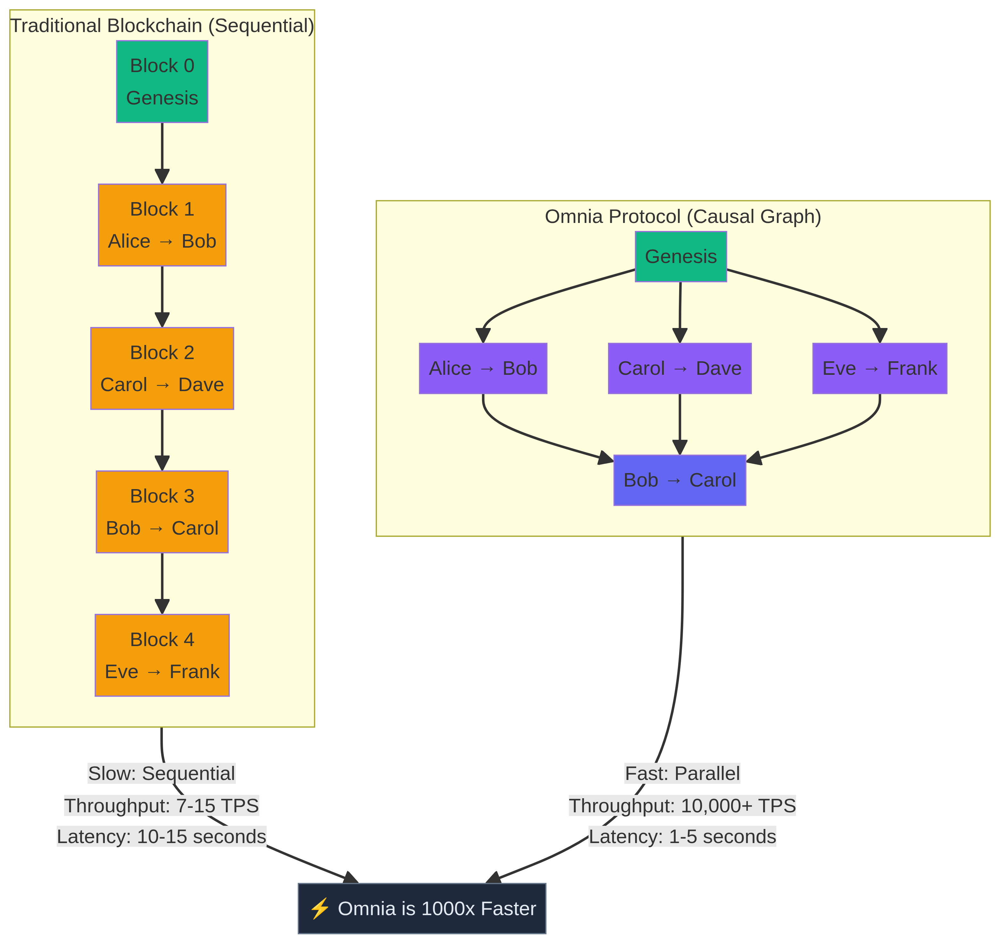
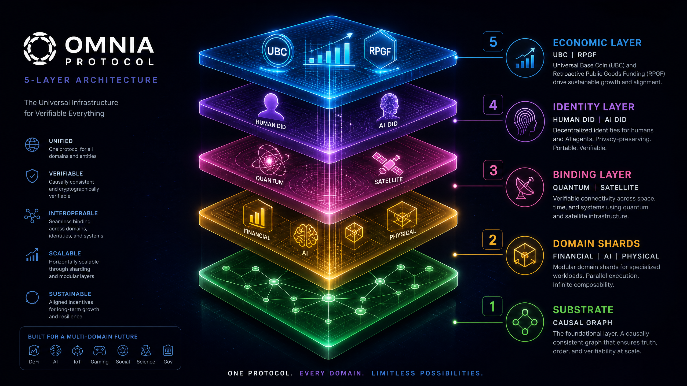

  

  
  
  
  
  
  
  

<h1 align="center">Omnia Protocol</h1>

  <strong>The Universal Coordination Layer for Reality</strong> 
  <em>A decentralized protocol that replaces trust with mathematics, enabling value exchange, identity verification, and physical-digital fusion without intermediaries.</em>

---

## 📊 Transparency Dashboard

To uphold our commitment to radical transparency, we maintain a live dashboard of our progress, requirements, and team health.

- [**Project Dashboard**](./PROJECT_DASHBOARD.md) - High-level overview, team status, and risk assessment.
- [**Requirements & Status**](./STATUS.md) - Granular tracking of technical requirements and completion.

## 🌌 Vision

Imagine a world where trust is not given—it is **mathematically guaranteed**. Omnia is building the infrastructure for a future where:

- **Identity is Sovereign:** A refugee can prove their identity without a passport.
- **Finance is Inclusive:** A farmer in Kenya can sell crops globally without a bank.
- **Data is Owned:** A scientist can share data without losing control.
- **AI is Ethical:** An AI agent can earn money and own property ethically.
- **Reality is Unified:** Every physical item has a cryptographic birth certificate.
- **Scale is Universal:** A Martian colony can trade with Earth without 22-minute delays.

---

## 💡 What Is Omnia?

Omnia is not a company, a coin, or an app. It is a **protocol**—a fundamental set of rules that any computer can follow to participate in a shared, unchangeable record of truth. Much like TCP/IP defines the internet, Omnia defines the **internet of value, identity, and trust**.

### The Problem We Solve

| Challenge | Impact | Omnia's Solution |
| :--- | :--- | :--- |
| **1.7 Billion Unbanked** | Lack of safe saving, borrowing, or sending | Participation via phone—no bank account needed |
| **Data Exploitation** | Corporate profit from personal info | User-controlled data via Zero-Knowledge Proofs |
| **Opaque Supply Chains** | Hidden child labor and fake medicine | Cryptographic birth certificates for physical items |
| **Centralized AI** | Corporate control of models and data | Distributed training with shared rewards |
| **Broken Governance** | Opaque decisions and ignored votes | Quadratic voting + reputation decay |
| **Inefficient Blockchains** | High fees and energy waste | Parallel causal graph consensus |
| **Speculative Crypto** | Wealth concentration and volatility | Universal Basic Compute for all participants |

---

## ⚡ Core Innovation: Causality, Not Clocks

Traditional blockchains operate like a single-file line, forcing unrelated events to wait for each other. Omnia utilizes **Causal Consistency**, allowing independent transactions to process in parallel.

  

---

## 🏗️ The Five Layers

Omnia Protocol is structured into five distinct, yet interconnected, layers, each addressing a critical aspect of decentralized coordination and reality fusion.

  

### 1. The Substrate (Physics-Aware Consensus)
The foundation that establishes agreement without relying on clock time, using **Causal Graphs**, **Vector Clocks**, and **CRDTs**.

### 2. Domain Shards (Specialized Lanes)
- **Financial:** Assets and derivatives.
- **Computational:** AI training and proofs.
- **Physical:** Supply chain and real estate.
- **Biological:** Health records and bio-signals.
- **Identity:** Humans, AI, and machines.

### 3. The Binding Layer (Reality Without Oracles)
Connecting the physical world to the digital layer via **RF Fingerprinting**, **Quantum Sealing**, and **Gravitational Timestamps**.

### 4. The Identity Layer (Self-Sovereign)
Permanent digital addresses (DIDs) for humans and AI agents, featuring **Social Recovery** and **Biometric Anchors**.

### 5. The Economic Layer (Universal Basic Compute)
Every identity receives a free monthly quota of transactions and compute power. Participation is a right, not a privilege.

---

## 🛡️ Zero-Knowledge Proofs

Omnia leverages **zk-SNARKs** to allow users to prove facts without revealing underlying data.
- Prove age without revealing birth date.
- Prove solvency without revealing balance.
- Prove authenticity without revealing supply chain details.

---

## 🗺️ Implementation Roadmap

### Phase 0: The Seed (Months 0-18)
*Goal: Proof of Concept*
- ZK-rollup on Ethereum
- Self-sovereign identity system
- Universal Basic Compute (UBC)

### Phase 1: The Root (Years 1-2)
*Goal: Independence*
- Standalone Layer 1 with causal-graph consensus
- Financial, Identity, and Physical shards
- Basic physical anchoring

### Phase 2: The Trunk (Years 3-5)
*Goal: Decentralization*
- Quantum-resistant cryptography
- Hardware mesh networks
- Proof-of-useful-work

### Phase 3: The Canopy (Years 5-10)
*Goal: Universality*
- Relativistic consensus for interplanetary operation
- Full physical-digital fusion
- Post-human governance

---

## 🚀 Getting Started

### 📚 Documentation
- [**Architecture**](./docs/specifications/ARCHITECTURE.md) - Technical deep-dives.
- [**Implementation**](./docs/specifications/IMPLEMENTATION.md) - Protocol specifications.
- [**Governance**](./docs/GOVERNANCE.md) - Community and decision-making.
- [**Use Cases**](./docs/USE_CASES.md) - Real-world applications.
- [**FAQ**](./docs/FAQ.md) - Common questions.

### 🤝 Contributing
Omnia thrives through open collaboration. See [**CONTRIBUTING.md**](./CONTRIBUTING.md) for guidelines.

---
### 💬 Community & Support

Omnia is a public-interest protocol. Join the conversation across our various channels:

- **[GitHub Discussions](https://github.com/Willow7737/omnia-protocol/discussions)** - The primary place for questions, ideas, and general community interaction.
- **[GitHub Issues](https://github.com/Willow7737/omnia-protocol/issues)** - For bug reports, feature requests, and technical research proposals.
- **[Project Dashboard](./PROJECT_DASHBOARD.md)** - For real-time project health and status updates.
- **[Requirements & Status](./STATUS.md)** - For granular tracking of technical requirements.
- **Discord:** Real-time chat and community (Link coming soon)
- **Forum:** Detailed discussions and proposals (Link coming soon)
- **Email:** `conduct@omnia.protocol` (for conduct-related issues)

---

## 📜 License

**Public Domain (CC0)** — No entity owns this protocol. Use it freely. Build on it. Improve it.

---

  <strong>Omnia is the infrastructure for a future where trust is mathematically guaranteed.</strong>

